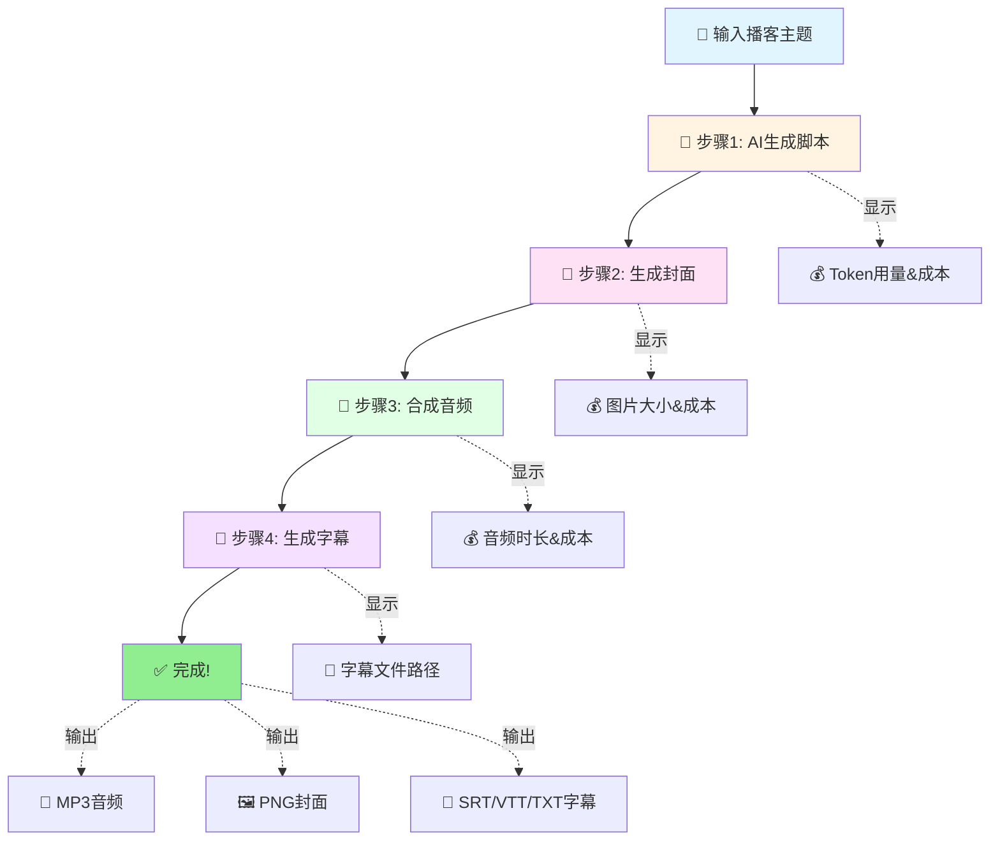
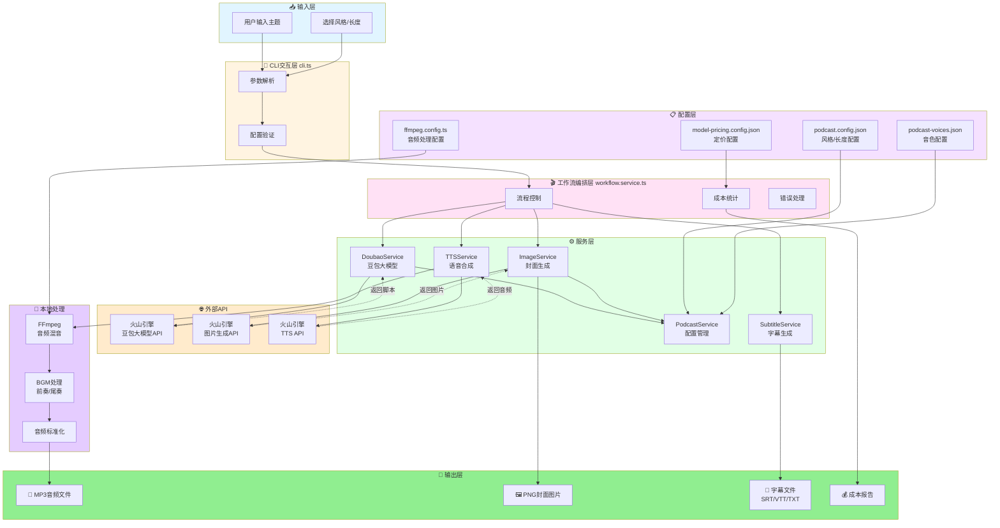

<div align="center">

# 🎙️ AI 播客工作流服务

<h3>✨ 一键生成专业级播客 ✨</h3>

**豆包大模型 + 多音色 TTS + 混音 + 智能字幕**  
从创意到成品，只需 2 分钟 | 成本低至 ¥0.68/集

[](https://www.typescriptlang.org/)
[](https://nodejs.org/)
[](LICENSE)
[](https://www.volcengine.com/)

[快速开始](#-快速开始) • [案例展示](#-案例展示) • [特性介绍](#-核心特性) • [播客配置](#-播客配置) • [成本说明](#-成本说明)

---

### 🎯 2 分钟生成你的第一个 AI 播客

```bash
# 克隆项目
git clone https://github.com/uiuing/ai-podcast-workflow.git
cd ai-podcast-workflow

# 安装依赖
npm install

# 配置 API 密钥（.env）
# 开始生成
npm start
```

<p align="center">
  <a href="#-快速开始">
    
  </a>
  &nbsp;&nbsp;
  <a href="#-案例展示">
    
  </a>
  &nbsp;&nbsp;
  <a href="https://github.com/uiuing/ai-podcast-workflow/issues">
    
  </a>
</p>

---

</div>

## 🎬 案例展示

<div align="center">

> ### 🎙️ 真实生成案例：《35岁危机：真困境还是伪命题？》
> 
> **风格**：幽默对谈 | **时长**：3分38秒 | **成本**：¥0.68 | **音色**：双人配音

<br>

### 📱 AI 自动生成的播客封面


*✨ AI 根据播客内容自动生成的 1:1 方形封面图 (1024×1024)*

---

### 🎵 完整播客音频

<table>
<tr>
<td align="center">

**🎙️ 音频信息**

</td>
</tr>
<tr>
<td>

- **📌 主题**：35岁危机：真困境还是伪命题？
- **🎭 风格**：幽默对谈 `humorous_dialogue`
- **⏱️ 时长**：3分38秒 (218秒)
- **👥 角色**：侃然（女声）× 悦心（女声）
- **🎵 特色**：
  - ✅ 背景音乐智能混音
  - ✅ 双音色 TTS 配音
  - ✅ 自然对话节奏
  - ✅ 前奏/尾奏处理

<audio controls>
  <source src="output/audios/35岁危机真困境还是伪命题_1762311727550.mp3" type="audio/mpeg">
  您的浏览器不支持音频播放。
</audio>


</td>
</tr>
</table>

---

### 📝 对话内容预览

<table>
<tr>
<td>

**💬 精选对话片段（带时间轴）**

</td>
</tr>
<tr>
<td>

```srt
1
00:00:06,000 --> 00:00:20,200
侃然：哎哟喂，悦心你说这35岁危机是不是真的啊？我最近刷朋友圈，
      全是30岁的人在那儿焦虑，说什么马上就要被职场淘汰了...

2
00:00:20,700 --> 00:00:33,700
悦心：哈哈，侃然你这还没到35呢就开始紧张啦？其实啊，35岁危机
      这个说法，最早是从互联网行业传出来的...

...

16
00:03:17,200 --> 00:03:26,600
悦心：哈哈，可不是嘛！所以啊，别被年龄数字绑架，专注提升自己
      才是王道。35岁不是终点，是新的起点呢！
```

**📄 完整字幕下载**（3种格式自动生成）：  
[📝 SRT](output/subtitles/35岁危机真困境还是伪命题_1762311727550.srt) • [🌐 VTT](output/subtitles/35岁危机真困境还是伪命题_1762311727550.vtt) • [📄 TXT](output/subtitles/35岁危机真困境还是伪命题_1762311727550.txt)

> ✨ **字幕特性**：时间轴精准同步 • 说话人自动标注 • 智能断句分段

</td>
</tr>
</table>

---

### 💰 生成成本明细（真实数据）

<table>
<tr>
<td align="center" colspan="3">

**📊 本案例实际成本拆解**

</td>
</tr>
<tr>
<td><b>项目</b></td>
<td><b>用量</b></td>
<td align="right"><b>成本</b></td>
</tr>
<tr>
<td>🤖 AI 文本生成</td>
<td>~6,000 tokens</td>
<td align="right"><code>¥0.0158</code></td>
</tr>
<tr>
<td>🎨 封面图生成</td>
<td>1 张 (1024×1024)</td>
<td align="right"><code>¥0.2000</code></td>
</tr>
<tr>
<td>🗣️ TTS 配音合成</td>
<td>~2,000 字符 (双音色)</td>
<td align="right"><code>¥0.4617</code></td>
</tr>
<tr>
<td>🎵 BGM 混音处理</td>
<td>本地 FFmpeg 处理</td>
<td align="right"><code>¥0.0000</code></td>
</tr>
<tr style="background-color: #f0f0f0;">
<td><b>💎 总计</b></td>
<td><b>3分38秒完整播客</b></td>
<td align="right"><b><code>¥0.6775</code></b></td>
</tr>
</table>

<br>

<div align="center">

### ✨ 平均每分钟成本：¥0.19

**从输入主题到生成完整播客，仅需 2 分钟，成本不到 7 毛钱！**

</div>

</div>

---

## ✨ 核心特性

<div align="center">

### 🆚 为什么要用AI制作播客？

</div>

<table>
<tr>
<td width="33%" align="center"><b>📊 对比项</b></td>
<td width="33%" align="center"><b>✅ 大模型方案</b></td>
<td width="33%" align="center"><b>❌ 人工方案</b></td>
</tr>
<tr>
<td><b>制作速度</b></td>
<td align="center">⚡ <b>2 分钟</b></td>
<td align="center">⏳ 数小时</td>
</tr>
<tr>
<td><b>制作成本</b></td>
<td align="center">💰 <b>¥0.68/集</b></td>
<td align="center">💸 百元起</td>
</tr>
<tr>
<td><b>技术门槛</b></td>
<td align="center">🎯 <b>极简配置</b></td>
<td align="center">🔧 需专业设备、环境、技能、经验</td>
</tr>
<tr>
<td><b>基础设施</b></td>
<td align="center">✅ <b>电脑</b></td>
<td align="center">📦 麦克风、声卡、耳机、环境、技能、经验</td>
</tr>
<tr>
<td><b>输出质量</b></td>
<td align="center">🎨 <b>专业级</b></td>
<td align="center">📈 参差不齐</td>
</tr>
</table>

---

<table>
<tr>
<td width="50%">

### 🎯 制作流程

- 🤖 **AI 智能生成** - 豆包大模型创作自然对话
- 🗣️ **多音色配音** - 双人/多人对话音色自动匹配
- 🎵 **专业混音** - BGM + 人声智能平衡
- 📝 **智能字幕** - SRT/VTT/TXT 三格式同步生成
- 🎨 **封面设计** - AI 自动生成主题匹配封面

</td>
<td width="50%">

### ⚡ 技术优势

- 🎯 **零基础设施** - 无需数据库/Redis/消息队列
- 💰 **成本透明** - 实时显示每步骤 API 成本
- 🎛️ **灵活配置** - 9种风格 × 3种长度 = 27种组合
- 📦 **开箱即用** - 配置环境变量即可开始
- ⚡ **极速生成** - 3分钟完成全流程

</td>
</tr>
</table>

## 🔄 工作流程

<div align="center">

### 从创意到成品，只需 4 步骤



</div>

---

### 🏗️ 技术架构流程图



<div align="center">

**🔄 数据流说明**
- 实线箭头 → 表示数据/控制流
- 虚线箭头 ⇢ 表示API响应
- 各层独立解耦，便于扩展和维护

</div>

---

<table>
<tr>
<td width="25%" align="center">

### 🤖 步骤 1
**AI 生成脚本**

调用豆包大模型  
智能选择音色  
生成封面提示词  
选择合适 BGM

💰 `¥0.01`

</td>
<td width="25%" align="center">

### 🎨 步骤 2
**生成封面**

根据提示词  
生成 1:1 封面图  
1024×1024 分辨率  
主题匹配

💰 `¥0.20`

</td>
<td width="25%" align="center">

### 🎵 步骤 3
**合成音频**

多音色 TTS 配音  
BGM 前奏/尾奏  
人声智能混音  
音频标准化

💰 `¥0.46`

</td>
<td width="25%" align="center">

### 📝 步骤 4
**生成字幕**

SRT 格式  
VTT 格式  
TXT 格式  
时间轴同步

💰 `¥0.00`

</td>
</tr>
</table>

---

<div align="center">

### 🎯 核心优势

| 特性 | 说明 |
|:----:|:-----|
| ✅ **零基础设施** | 无需数据库、Redis、消息队列等复杂组件 |
| ⚡ **极速生成** | 单个终端会话完成全流程，3分钟交付成品 |
| 💰 **成本透明** | 每个步骤实时显示 API 成本，终端输出详细统计 |
| 📦 **开箱即用** | 配置环境变量即可开始，无复杂部署流程 |
| 🎛️ **高度灵活** | 9种播客风格 × 3种时长 = 27种个性化组合 |

</div>

## 📦 快速开始

<div align="center">

### ⚡ 5 分钟上手指南

</div>

<table>
<tr>
<td width="33%" align="center">

### 📋 第一步
**准备环境**

安装 Node.js (≥18.x)  
安装 FFmpeg (≥4.0)  
注册火山引擎账号

🎁 新用户有免费额度

</td>
<td width="33%" align="center">

### ⚙️ 第二步
**安装配置**

克隆项目  
安装依赖  
配置 API 密钥

⚡ 无需数据库等组件

</td>
<td width="33%" align="center">

### 🚀 第三步
**开始生成**

输入播客主题  
选择风格和长度  
等待 2 分钟

✅ 播客制作完成！

</td>
</tr>
</table>

---

### 📥 安装步骤

<details open>
<summary><b>🔧 安装 FFmpeg（音频处理必需）</b></summary>

**Windows:**
```bash
choco install ffmpeg
```

**macOS:**
```bash
brew install ffmpeg
```

**Linux:**
```bash
sudo apt update && sudo apt install ffmpeg
```

</details>

<details open>
<summary><b>📦 克隆项目并安装依赖</b></summary>

```bash
# 克隆项目
git clone https://github.com/uiuing/ai-podcast-workflow.git
cd ai-podcast-workflow

# 安装依赖（选择其一）
npm install
# 或 yarn install
# 或 pnpm install
```

> 💡 **零依赖部署**：无需数据库、Redis、消息队列等复杂基础设施！

</details>

<details open>
<summary><b>🔑 配置环境变量</b></summary>

1. **复制配置模板**
```bash
cp .env.example .env
```

2. **编辑 `.env` 文件，填入火山引擎 API 密钥：**

```env
# 豆包大模型配置
DOUBAO_API_KEY=your_doubao_api_key_here

# 图片生成配置
IMAGE_API_KEY=your_image_api_key_here

# TTS 语音合成配置
TTS_APP_ID=your_tts_app_id_here
TTS_ACCESS_TOKEN=your_tts_access_token_here
```

3. **获取 API 密钥**：访问 [火山引擎控制台](https://console.volcengine.com/) 注册并创建密钥

</details>

---

### 🚀 开始使用

<table>
<tr>
<td width="50%">

**🎯 交互式模式（推荐新手）**

```bash
npm start
```

系统会引导你：
1. 输入播客主题
2. 选择播客长度（brief/standard/deep）
3. 选择播客风格（9种）
4. 等待生成完成

</td>
<td width="50%">

**⚡ 命令行模式（适合批量/自动化）**

```bash
npm start -- \
  --input "35岁危机真困境还是伪命题" \
  --format standard \
  --style humorous_dialogue
```

一条命令搞定：
- `--input` 播客主题
- `--format` 长度（brief/standard/deep）
- `--style` 风格（9种可选）

</td>
</tr>
</table>

<div align="center">

### ⏱️ 等待 2 分钟，你的专业播客就完成了！

输出目录 `output/` 包含：
🎵 **MP3 音频** • 🖼️ **PNG 封面** • 📝 **SRT/VTT/TXT 字幕**

</div>

## 🎨 播客配置

<div align="center">

### 🎛️ 9 种风格 × 3 种长度 = 27 种个性化组合

</div>

---

### 📏 播客长度选择

<table>
<tr>
<td width="33%" align="center">

### ⚡ Brief
**快闪洞察**

📊 **1200-2000 字**  
⏱️ **5-10 分钟**

💡 适用场景：
- 🚇 地铁通勤
- ☕ 午休时间
- 🏃 晨跑健身

</td>
<td width="33%" align="center">

### 🎯 Standard
**沉浸解读**

📊 **2000-3000 字**  
⏱️ **10-15 分钟**

💡 适用场景：
- 🚗 开车通勤
- 📚 系统学习
- 🎧 专注收听

</td>
<td width="33%" align="center">

### 🔬 Deep
**透彻剖析**

📊 **3000-4000 字**  
⏱️ **15-20 分钟**

💡 适用场景：
- 📖 专业研究
- 🧠 深度学习
- 🎓 完整知识

</td>
</tr>
</table>

---

### 🎭 播客风格选择

<table>
<tr>
<td width="33%">

#### 🎉 轻松休闲

- **😄 幽默对谈** `humorous_dialogue`  
  轻松愉快的双人对话，像朋友聊天

- **🤣 吐槽漫谈** `manzai`  
  日式漫才风格，在欢笑中学习

- **🌙 深夜电台** `midnight_radio`  
  温柔治愈的深夜陪伴

</td>
<td width="33%">

#### 🎓 专业学习

- **🎤 深度访谈** `interview`  
  专业而不失温度的深度对话

- **💭 思辨论坛** `debate`  
  多角度碰撞，激发批判性思维

- **📚 实战课堂** `tutorial`  
  手把手教学，边听边学

</td>
<td width="33%">

#### 🎬 创意叙事

- **📖 故事剧场** `storytelling`  
  用引人入胜的故事串联知识

- **🔍 纪实探索** `documentary`  
  纪录片式深度探究，追根溯源

- **🔥 热点解读** `hot_topic`  
  从热点事件切入，深挖背后知识

</td>
</tr>
</table>

---

### 💡 推荐组合示例

<details>
<summary><b>🚇 通勤场景（5-10分钟轻松内容）</b></summary>

```bash
# 幽默对谈 - 轻松了解 AI 技术
npm start -- --input "ChatGPT 背后的技术原理" --format brief --style humorous_dialogue

# 热点解读 - 快速理解热点
npm start -- --input "元宇宙到底是什么" --format brief --style hot_topic
```

</details>

<details>
<summary><b>📚 学习场景（10-15分钟系统内容）</b></summary>

```bash
# 深度访谈 - 系统学习新知识
npm start -- --input "区块链技术详解" --format standard --style interview

# 实战课堂 - 边听边学实践技能
npm start -- --input "Python 数据分析入门" --format standard --style tutorial
```

</details>

<details>
<summary><b>🧠 深度场景（15-20分钟专业内容）</b></summary>

```bash
# 纪实探索 - 深度探究复杂主题
npm start -- --input "量子计算的现状与未来" --format deep --style documentary

# 思辨论坛 - 多角度分析问题
npm start -- --input "人工智能的伦理困境" --format deep --style debate
```

</details>

<details>
<summary><b>🌙 睡前场景（温柔治愈内容）</b></summary>

```bash
# 深夜电台 - 治愈系播客
npm start -- --input "冥想与正念的科学" --format standard --style midnight_radio

# 故事剧场 - 睡前故事
npm start -- --input "宇宙的起源与演化" --format standard --style storytelling
```

</details>

## 📁 项目结构

```
ai-podcast-workflow/
├── src/
│   ├── cli.ts                          # 🎯 CLI 入口（命令行交互）
│   ├── config/
│   │   ├── config.ts                   # 配置管理（环境变量）
│   │   ├── ffmpeg.config.ts            # FFmpeg 配置
│   │   ├── podcast.config.json         # 播客格式和风格（9种×3种）
│   │   ├── podcast-voices.json         # TTS 声音配置（多音色配音）
│   │   ├── model-pricing.config.json   # API 定价配置（成本计算）
│   │   ├── audio-normalization.config.json # 音频标准化配置
│   │   └── bgm/                        # 内置 BGM 音频文件
│   ├── services/
│   │   ├── workflow.service.ts         # 🎬 工作流编排（核心逻辑）
│   │   ├── doubao.service.ts           # 豆包大模型服务（AI 内容生成）
│   │   ├── image.service.ts            # 图片生成服务（封面生成）
│   │   ├── tts.service.ts              # TTS 语音合成服务（配音 + 口播）
│   │   ├── podcast.service.ts          # 播客配置服务
│   │   └── model-config.service.ts     # 模型配置和定价服务（成本计算）
│   ├── types/
│   │   ├── podcast.types.ts            # 播客类型定义
│   │   ├── image.types.ts              # 图片类型定义
│   │   └── index.ts                    # 类型导出
│   └── plugins/
│       └── volcengine/                  # 火山引擎 TTS 插件
│           ├── protocols.ts
│           └── unidirectional_stream.ts
├── output/                              # 📁 生成的文件输出目录
│   ├── audios/                          # MP3 音频文件（配音 + BGM 混音）
│   ├── covers/                          # PNG 封面图片
│   └── subtitles/                       # 字幕文件（SRT/VTT/TXT）
├── .env.example                         # 环境变量模板
├── .gitignore                           # Git 忽略规则
├── LICENSE                              # MIT 许可证
├── package.json                         # 依赖配置（极简依赖）
├── tsconfig.json                        # TypeScript 配置
├── README.md                            # 本文档
├── QUICKSTART.md                        # 快速开始指南
├── CHANGELOG.md                         # 更新日志
└── PROJECT_SUMMARY.md                   # 项目改造总结
```

> 💡 **核心特点：** 
> - ✅ **无数据库** - 不需要 MySQL、PostgreSQL、MongoDB
> - ✅ **无 Redis** - 不需要缓存服务器
> - ✅ **无消息队列** - 不需要 Bull、RabbitMQ、Kafka
> - ✅ **无 Web 服务器** - 不需要 Express、Fastify
> - ✅ **纯工作流** - 专注于 AI 播客生成流程，极简架构
> - ✅ **终端输出** - 所有结果和成本实时输出到终端

## 💰 成本说明

### 📊 真实生成案例成本（3分38秒播客）

基于实际生成的播客《35岁危机：真困境还是伪命题？》：

| 步骤 | API | 用量 | 单价 | 成本 |
|---|---|---|---|---|
| AI 文本生成 | 豆包大模型 | ~6,000 tokens | ¥0.26/万tokens | ¥0.0158 |
| 封面图生成 | 豆包 Seedream 4.0 | 1 张图 (1024×1024) | ¥0.20/张 | ¥0.2000 |
| TTS 配音合成 | 火山引擎 TTS | ~2,000 字符 | ¥23/万字符 | ¥0.4617 |
| BGM 混音 | FFmpeg（本地） | - | 免费 | ¥0.0000 |
| **总计** | - | - | - | **¥0.6775** |

> 💡 **成本优化建议：**
> - 选择 `brief` 格式（5-10分钟）可降低 TTS 成本 40%+
> - 使用 TTS 标准音色替代精品音色可降低成本
> - 重复使用已生成的封面
> - 批量生成多集播客分摊固定成本
>
> 🎁 **新用户福利：** 火山引擎新用户有免费额度，可免费生成多集播客！

### 终端成本输出示例（真实数据）

```
📊 成本统计
   AI 文本生成: ¥0.0158
   封面图生成: ¥0.2000
   TTS 音频合成: ¥0.4617
   ────────────────────────────────
   总计: ¥0.6775

📁 输出文件
   🎵 音频: output/audios/35岁危机真困境还是伪命题_1762311727550.mp3 (3分38秒)
   🖼️  封面: output/covers/35岁危机真困境还是伪命题_1762311727550.png
   📝 字幕 (SRT): output/subtitles/35岁危机真困境还是伪命题_1762311727550.srt
   📝 字幕 (VTT): output/subtitles/35岁危机真困境还是伪命题_1762311727550.vtt
   📝 字幕 (TXT): output/subtitles/35岁危机真困境还是伪命题_1762311727550.txt
```

## 🎵 BGM 资源

项目内置 **无版权背景音乐**，AI 会根据播客主题和风格自动选择最合适的 BGM：

| 类型 | 文件名 | 适用场景 |
|-----|-------|---------|
| **访谈类** | `interview-podcast-background-music-*.mp3` | 专业访谈、深度对话 |
| **爵士风格** | `podcast-smooth-jazz-*.mp3` | 轻松对话、文化节目 |
| **轻松氛围** | `aesthetic-boomopera-podcast-lofi-lounge-*.mp3` | 生活分享、深夜电台 |
| **节奏感强** | `positive-hip-hop-beat-music-*.mp3` | 年轻话题、热点解读 |
| **通用** | `intro-*.mp3`, `flow-*.mp3` | 各类播客通用 |

**BGM 特性：**
- ✅ 智能混音 - 自动调节 BGM 和人声音量
- ✅ 前奏/尾奏 - 可配置播放时长
- ✅ 专业效果 - 媲美人工后期制作
- ✅ 无版权风险 - 可自由添加自己的 BGM

## 📝 字幕功能

项目自动生成 **3 种格式的字幕文件**，适配不同播放场景：

| 格式 | 文件扩展名 | 适用场景 | 特性 |
|-----|----------|---------|------|
| **SRT** | `.srt` | 通用播放器 | 最通用的字幕格式，支持几乎所有播放器 |
| **VTT** | `.vtt` | Web 播放器 | HTML5 视频标准字幕格式，支持样式 |
| **TXT** | `.txt` | 文本阅读 | 纯文本格式，带时间戳和说话人标注 |

**字幕内容示例（SRT）：**
```
1
00:00:05,000 --> 00:00:12,400
主持人：大家好，欢迎来到今天的播客节目。

2
00:00:12,900 --> 00:00:20,300
嘉宾：很高兴能参加这期节目。

3
00:00:20,800 --> 00:00:35,600
主持人：今天我们要聊的话题是人工智能的伦理问题。
```

**字幕特性：**
- ✅ **时间轴同步** - 根据语音时长自动计算时间戳
- ✅ **说话人标注** - 每句字幕标明说话人姓名
- ✅ **智能断句** - 按对话轮次自然分割
- ✅ **多格式支持** - 同时生成 SRT/VTT/TXT 三种格式
- ✅ **开箱即用** - 无需额外配置，自动生成

## 🔧 高级配置

### 自定义 TTS 声音

编辑 `src/config/podcast-voices.json`，添加你的声音配置：

```json
{
  "id": "custom_voice_01",
  "name": "BV001_streaming",
  "originalName": "通用女声",
  "description": "温柔的女声，适合讲故事",
  "gender": "female",
  "lang": "zh-CN",
  "model": "streaming"
}
```

### 调整 BGM 音量

编辑 `src/config/podcast.config.json`：

```json
{
  "audio_mixing": {
    "bgm_volume": 0.25,     // BGM 音量 (0.0-1.0)
    "voice_volume": 1.0     // 人声音量 (0.0-1.0)
  }
}
```

### 音频质量配置

编辑 `src/config/audio-normalization.config.json`：

```json
{
  "normalization": {
    "enabled": true,
    "mode": "loudnorm"      // 或 "compressor"
  },
  "loudnorm": {
    "I": -16,               // 目标响度 (dB)
    "TP": -1.5,             // 真峰值限制 (dB)
    "LRA": 11               // 响度范围 (dB)
  }
}
```

## 🛠️ 开发

### 编译项目

```bash
npm run build
```

### 运行测试

```bash
npm test
```

### 代码检查

```bash
npm run lint
```

## 📝 命令行参数

```bash
npm start -- [选项]

选项:
  -i, --input <text>     播客主题（必填）
  -f, --format <type>    播客格式: brief | standard | deep (默认: standard)
  -s, --style <type>     播客风格: humorous_dialogue | manzai | storytelling 
                         interview | debate | tutorial | documentary 
                         hot_topic | midnight_radio (默认: interview)
  -o, --output <dir>     输出目录 (默认: ./output)
  -v, --verbose          显示详细日志
  -h, --help             显示帮助信息
```

### 示例

```bash
# 基础用法
npm start -- --input "人工智能的伦理问题"

# 完整配置
npm start -- \
  --input "ChatGPT 如何改变我们的工作方式" \
  --format standard \
  --style interview \
  --output ./my-podcasts \
  --verbose

# 快速模式（短播客 + 幽默风格）
npm start -- -i "什么是元宇宙" -f brief -s manzai
```

## 🎯 适用场景

这个纯工作流案例适合：

- 📚 **学习 AI 应用开发** - 完整的端到端实现，无复杂基础设施，适合学习和参考
- 🚀 **快速原型开发** - 零部署成本，快速验证 AI 播客生成想法
- 🎨 **二次开发** - 清晰的模块化设计，易于定制和扩展（添加数据库、Web API 等）
- 📖 **技术分享** - 展示如何整合豆包大模型、TTS、音频处理等 AI 服务
- 🎓 **教学演示** - 直观的终端输出和成本统计，适合课堂演示
- 🎙️ **个人播客制作** - 支持 BGM、配音、口播，快速生成专业播客内容
- 🔧 **工作流研究** - 纯工作流实现，专注于 AI 服务编排和流程设计

## 🔧 高级配置

### 自定义 TTS 声音

编辑 `src/config/podcast-voices.json`，添加你的声音配置：

```json
{
  "id": "custom_voice_01",
  "name": "BV001_streaming",
  "originalName": "通用女声",
  "description": "温柔的女声，适合讲故事",
  "gender": "female",
  "lang": "zh-CN",
  "model": "streaming"
}
```

### 调整 BGM 音量

编辑 `src/config/podcast.config.json`：

```json
{
  "audio_mixing": {
    "bgm_volume": 0.25,     // BGM 音量 (0.0-1.0)
    "voice_volume": 1.0     // 人声音量 (0.0-1.0)
  }
}
```

### 音频质量配置

编辑 `src/config/audio-normalization.config.json`：

```json
{
  "normalization": {
    "enabled": true,
    "mode": "loudnorm"      // 或 "compressor"
  },
  "loudnorm": {
    "I": -16,               // 目标响度 (dB)
    "TP": -1.5,             // 真峰值限制 (dB)
    "LRA": 11               // 响度范围 (dB)
  }
}
```

## 🛠️ 开发

### 编译项目

```bash
npm run build
```

### 开发模式（自动重启）

```bash
npm run dev
```

### 生产运行

```bash
npm run prod
```

## 🤝 贡献

欢迎提交 Issue 和 Pull Request！

1. Fork 本仓库
2. 创建你的特性分支 (`git checkout -b feature/AmazingFeature`)
3. 提交你的更改 (`git commit -m 'Add some AmazingFeature'`)
4. 推送到分支 (`git push origin feature/AmazingFeature`)
5. 打开一个 Pull Request

## ❓ 常见问题

<details>
<summary><b>Q: 为什么不使用数据库？</b></summary>

A: 这是一个**纯工作流案例**，重点展示 AI 播客生成的完整流程。去除数据库、Redis、消息队列等复杂基础设施，让项目更简单、易学习、易部署。所有结果输出到文件和终端，成本透明可见。如果需要用户系统、任务管理等功能，可以在此基础上添加数据库支持。
</details>

<details>
<summary><b>Q: 成本会很高吗？</b></summary>

A: 非常低！根据真实案例，生成一集 3-4 分钟的播客（包含 BGM、双音色配音、封面、字幕）约 ¥0.68。火山引擎新用户还有免费额度，可以免费生成多集播客。所有成本实时显示在终端。你可以通过使用更短的格式、标准音色等方式进一步降低成本。
</details>

<details>
<summary><b>Q: 支持哪些播客形式？</b></summary>

A: 支持多种形式：
- **单人口播** - 一人讲述，适合知识分享、故事讲述
- **双人对话** - 两人对话，适合访谈、讨论
- **多人讨论** - 三人以上，适合圆桌讨论、辩论
AI 会根据主题和风格自动选择最合适的形式和音色配音。
</details>

<details>
<summary><b>Q: 可以用其他 AI 服务替代吗？</b></summary>

A: 可以！项目采用模块化设计，你可以轻松替换成其他大模型（如 OpenAI GPT、Claude、Azure OpenAI）或 TTS 服务（如 OpenAI TTS、Azure TTS、Google TTS）。只需修改对应的 service 文件即可。
</details>

<details>
<summary><b>Q: 如何添加自己的 BGM？</b></summary>

A: 将 MP3 文件放入 `src/config/bgm/` 目录，AI 会根据播客主题和风格自动选择合适的 BGM。你也可以在配置中指定特定的 BGM 文件名（参考依据为BGM名称，建议以风格以及乐器以及场景命名BGM）。
</details>

<details>
<summary><b>Q: 这个项目可以商用吗？</b></summary>

A: 本项目采用 MIT 许可证，可以自由使用、修改和商用。但请注意：
- 火山引擎 API 调用需要你自己的账号和付费
- 如需商用，建议添加用户认证、数据库等功能
- 请遵守火山引擎的服务条款
</details>

## 📄 开源协议

本项目采用 **MIT 许可证**，可自由使用、修改和商用。详见 [LICENSE](LICENSE) 文件。

---

<div align="center">

## 🙏 致谢

感谢以下开源项目和服务的支持：

| 服务/工具 | 用途 | 链接 |
|:---:|:---:|:---:|
| 🔥 **火山引擎** | 豆包大模型 / TTS / 图片生成 | [官网](https://www.volcengine.com/) |
| 🎬 **FFmpeg** | 音频混音与处理 | [官网](https://ffmpeg.org/) |
| 🎵 **免费音乐库** | 无版权 BGM 资源 | - |

---

## 📮 联系与支持

<table>
<tr>
<td align="center" width="33%">

### 💬 问题反馈

遇到问题？  
[提交 Issue](https://github.com/uiuing/ai-podcast-workflow/issues)

</td>
<td align="center" width="33%">

### ⭐ Star 支持

觉得有帮助？  
给项目一个 Star！

</td>
<td align="center" width="33%">

### 🔔 关注更新

想获取最新动态？  
Watch 本项目

</td>
</tr>
</table>

---

## 🌟 最后

<br>

### ⭐ 如果这个项目对你有帮助，欢迎点个 Star！

<br>

<p align="center">
  
</p>

<br>

